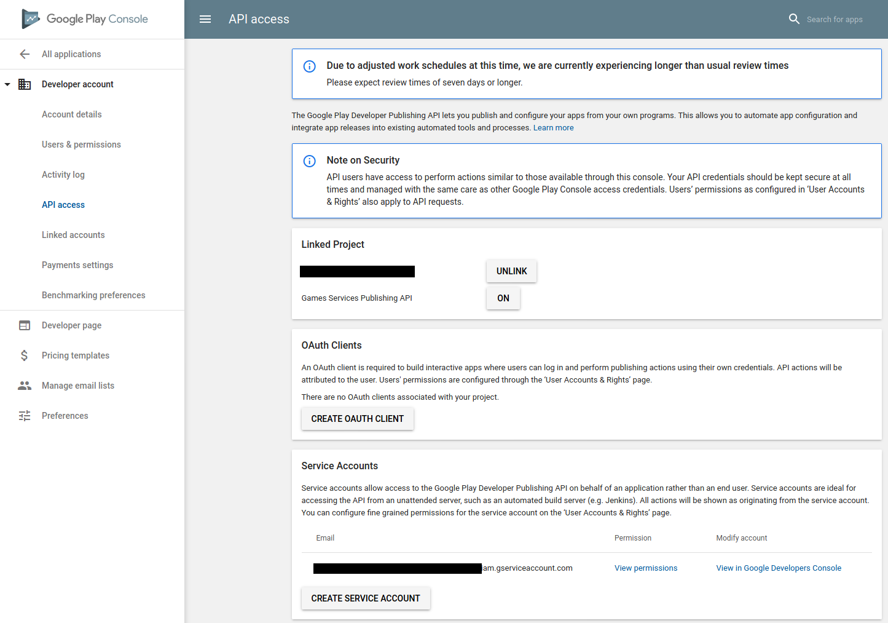
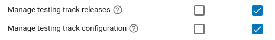

# Configuring google service account

This guide is simplified. For further information; look at googles documentation or find dedicated examples online.

## Creation of the service acccount:
1. Go to [Google Cloud Console](https://console.cloud.google.com)
2. Create a new project or use an existing one
3. Enable the PlayConsole API:  

4. Create a service account by clicking on `manage service accounts:`  

5. Create json key's for the service account and store them somwhere safe yet accessible from your publishing environment:  

## Enable GooglePlayConsole API access for the service account:
1. Go to the Google Play Console
2. On the `all applications` page, go to `settings`
3. Under `Developer account` in `API access` add your project to which you added the Service account and add the Service Account:  

4. After that click on `View permissions` on the Settings account and change the permissions:  
  
Only those from the screenshot are needed!
