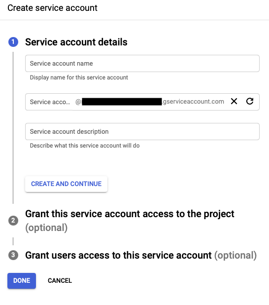
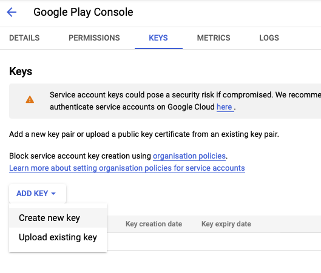

# Configuring Google Service Account

> Note: This guide is simplified. For further information look at Google's documentation or find dedicated examples online.

## 1. Create / Select a Google Cloud Project

A Google Service Account must be created / configured in a Google Cloud Project. There are two approaches to achieve
this, select either 1.1. or 1.2.

### 1.1. Create a new Google Cloud Project directly from the Google Play Console

1. Go to [Google Play Console](https://play.google.com/apps/publish)
2. Go to "Setup > API Access" and select the option to create a project for you.

### 1.2. Use an existing Google Cloud Project or create a Google Cloud Project manually.

1. Go to [Google Cloud Console](https://console.cloud.google.com)
2. Create a new project or select an existing one
3. Enable the "Google Play Android Developer API" (see "APIs and Services > Library")

   

5. Go to [Google Play Console](https://play.google.com/apps/publish)
6. Go to "Setup > API Access" and link the desired Google Cloud Project.

## 2. Create a Service Account

1. Go to [Google Cloud Console](https://console.cloud.google.com)
2. Go to "IAM & Admin > Service Accounts" and select "Create Service Account"

   

   > Note: In the optional step (2), you may want to give this account a role to access the cloud project
   > (e.g. Viewer), otherwise the account might not show up in the Google Play Console.
   > In that case you have to add the account manually instead of with the click of a button (see below).
   > Once permissions are granted in the Google Play Console, you should remove the access to the cloud project.

4. Create JSON key's for the service account and store them somewhere safe yet accessible from your publishing
   environment

   

## 3. Enable GooglePlayConsole API access for the service account:

1. Go to [Google Play Console](https://play.google.com/apps/publish)
2. Go to "Setup > API Access" and select "Grant Access" option for the previously created account.

   > If the user does not show up in the list of service accounts, it probably doesn't have a role assigned in
   > the Google Cloud Project. Assign it a (temporary) role and to fix this problem.
   > Alternatively: Get the service account's e-mail address directly from the Google Cloud Console
   > and add it manually to the project by going to "Users and permissions > Invite new users".

3. Grant the necessary permissions to the service account, depending on your needs. Check the "Release" permissions and
   select the ones you would like to grant to the service account. It is recommended to grant only the permissions you
   absolutely need for the API upload to work. Google likes to rename the permissions from time to time, therefore we
   do not list the exact permissions here, instead we recommend reading the official descriptions and documentation.
